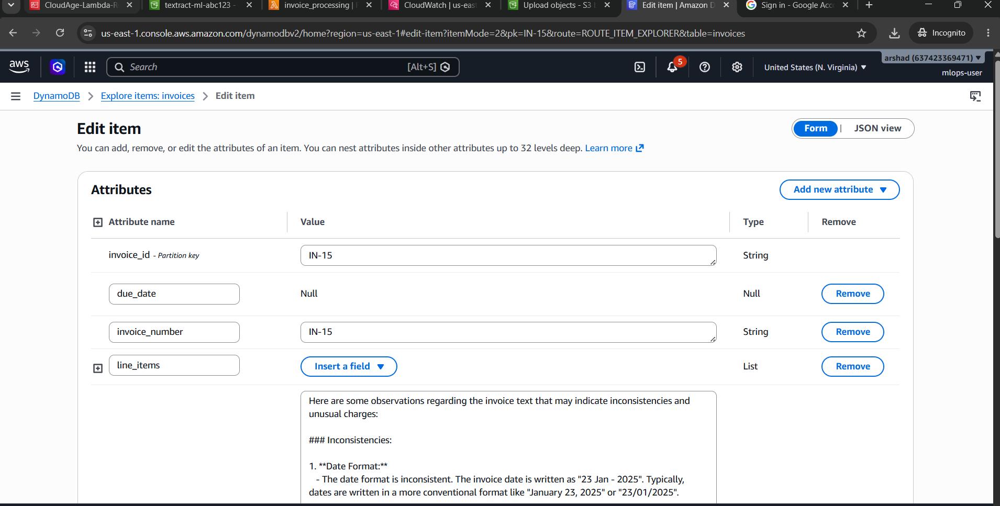

# Invoice Processing Lambda Function

Automated invoice processing using AWS Textract, Bedrock AI, and DynamoDB.

## 🏗️ Architecture

```
S3 Upload → Lambda Trigger → Textract (OCR) → Bedrock (AI Analysis) → DynamoDB Storage
                                    ↓
                            S3 (Processed Text Backup)
```

## 📋 Prerequisites

### Required AWS Services
1. **S3 Buckets**
   - Source bucket (for invoice uploads)
   - Destination bucket (for processed text) - **YOU NEED TO CREATE THIS**

2. **DynamoDB Table**
   - Table name: `invoices`
   - Primary key: `invoice_id` (String)

3. **AWS Services Enabled**
   - Amazon Textract
   - Amazon Bedrock (with Nova Lite model access)

4. **IAM Role for Lambda** with permissions for:
   - S3 Read/Write
   - Textract AnalyzeExpense
   - Bedrock InvokeModel
   - DynamoDB PutItem
   - CloudWatch Logs

## 🚀 Quick Setup

### Step 1: Create the Output S3 Bucket

Run the setup script:
```bash
python setup_s3_bucket.py
```

This will:
- Create the S3 bucket for processed text
- Display the bucket name
- Show configuration instructions

### Step 2: Configure Lambda Environment Variable

Add this environment variable to your Lambda function:
```
TEXTRACT_OUTPUT_BUCKET=textract-project-ml-ai-XXXXXXXX
```

**How to add via AWS Console:**
1. Go to Lambda Console
2. Select your function
3. Go to "Configuration" → "Environment variables"
4. Click "Edit"
5. Add: `TEXTRACT_OUTPUT_BUCKET` = `your-bucket-name`

**How to add via AWS CLI:**
```bash
aws lambda update-function-configuration \
    --function-name YOUR_LAMBDA_FUNCTION_NAME \
    --environment Variables={TEXTRACT_OUTPUT_BUCKET=textract-project-ml-ai-XXXXXXXX}
```

### Step 3: Update IAM Permissions

Add S3 write permissions to your Lambda's IAM role:

```json
{
    "Version": "2012-10-17",
    "Statement": [
        {
            "Effect": "Allow",
            "Action": [
                "s3:PutObject",
                "s3:GetObject",
                "s3:HeadBucket"
            ],
            "Resource": [
                "arn:aws:s3:::textract-project-ml-ai-*/*",
                "arn:aws:s3:::textract-project-ml-ai-*"
            ]
        }
    ]
}
```

### Step 4: Deploy Lambda Function

Upload `index.py` to your Lambda function.

## 🔧 Configuration Options

The Lambda function has **4 fallback strategies** for saving processed text:

### Strategy 1: Environment Variable (Recommended)
Set `TEXTRACT_OUTPUT_BUCKET` environment variable.

### Strategy 2: Auto-generated Bucket Name
Uses pattern: `textract-project-ml-ai-{suffix}`
- Suffix extracted from source bucket name

### Strategy 3: Same Bucket as Source
Saves to `{source-bucket}/processed-text/filename.txt`

### Strategy 4: Default Bucket
Tries bucket: `textract-processed-invoices`

## 📊 DynamoDB Table Schema

```python
{
    'invoice_id': 'INV-12345',          # Primary key
    'invoice_number': 'INV-12345',
    'due_date': '2024-03-15',
    'receipt_date': '2024-02-15',
    'total': '$1,234.56',
    'line_items': [
        {'item': 'Product A', 'price': '$100.00'},
        {'item': 'Product B', 'price': '$200.00'}
    ],
    'llm_analysis': 'AI-generated analysis text...'
}
```

### Sample DynamoDB Output



## 🐛 Troubleshooting

### Issue: "Bucket does not exist" Error

**Problem:** Lambda can't find the output bucket.

**Solutions:**

1. **Create the bucket using setup script:**
   ```bash
   python setup_s3_bucket.py
   ```

2. **Manually create the bucket:**
   ```bash
   aws s3 mb s3://textract-project-ml-ai-12345678 --region us-east-1
   ```

3. **Set environment variable:**
   Add `TEXTRACT_OUTPUT_BUCKET` to Lambda configuration

4. **Check CloudWatch Logs:**
   The function will log which strategy it's attempting:
   ```
   Saved text to configured bucket: textract-project-ml-ai-xxx/invoice.txt
   ```

### Issue: "Access Denied" Error

**Problem:** Lambda doesn't have permission to write to S3.

**Solution:** Update IAM role with S3 permissions (see Step 3 above)

### Issue: Bedrock Throttling Errors

**Problem:** Too many Bedrock API calls.

**Solutions:**

1. **Adjust rate limiter** in `index.py`:
   ```python
   bedrock_rate_limiter = RateLimiter(max_requests_per_minute=5)
   ```

2. **Request quota increase** in AWS Service Quotas console

3. **Check CloudWatch Logs** for retry attempts:
   ```
   ThrottlingException: Retry 1/4 after 2.34s
   ```

### Issue: Invoice Processing Fails

**Check CloudWatch Logs for:**
1. Textract errors (invalid image format, etc.)
2. DynamoDB errors (table doesn't exist, permission issues)
3. Bedrock errors (model not available in region)

**Common Fixes:**
- Ensure invoice is in supported format (PNG, JPG, PDF)
- Verify DynamoDB table `invoices` exists
- Check Bedrock model availability in your region

## 📝 Manual Testing

### Test the Lambda function:

```bash
# Upload test invoice to S3
aws s3 cp sample-invoice.jpg s3://your-source-bucket/

# Check CloudWatch Logs
aws logs tail /aws/lambda/your-function-name --follow

# Verify DynamoDB entry
aws dynamodb scan --table-name invoices --limit 1

# Check processed text in S3
aws s3 ls s3://textract-ml-ai-XXXXXXXX/
```

## 🎯 Expected Behavior

When working correctly:

1. Invoice uploaded to source S3 bucket
2. Lambda triggered automatically
3. Textract extracts invoice data
4. Bedrock analyzes for inconsistencies
5. Data saved to DynamoDB
6. Processed text saved to output S3 bucket
7. Success response returned

**CloudWatch Log Output:**
```
Processing invoice: invoice-123.jpg from bucket: source-bucket
Saved text to configured bucket: textract-project-ml-ai-xxx/invoice-123.txt
Successfully inserted invoice INV-123 into DynamoDB
Successfully processed invoice: invoice-123.jpg
```

## 🔑 Environment Variables Reference

| Variable | Required | Default | Description |
|----------|----------|---------|-------------|
| `AWS_REGION` | Yes (Auto) | Auto-set | AWS region |
| `TEXTRACT_OUTPUT_BUCKET` | Recommended | None | Output S3 bucket name |

## 📞 Support

If you encounter issues:
1. Check CloudWatch Logs first
2. Verify all AWS services are enabled in your region
3. Confirm IAM permissions are correct
4. Ensure all buckets exist and are accessible

## 📄 License

This project is provided as-is for educational purposes.
